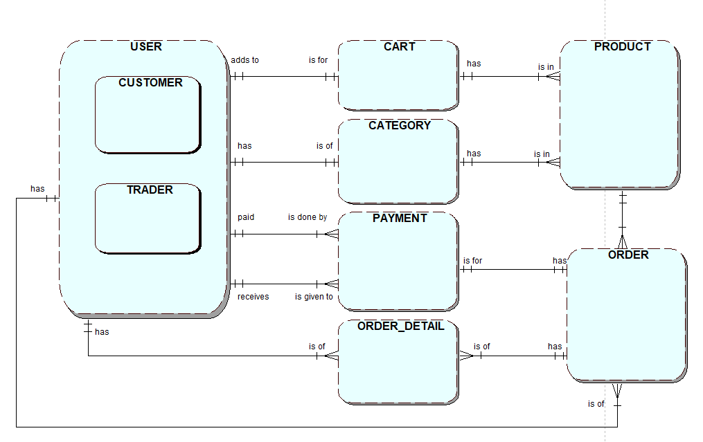
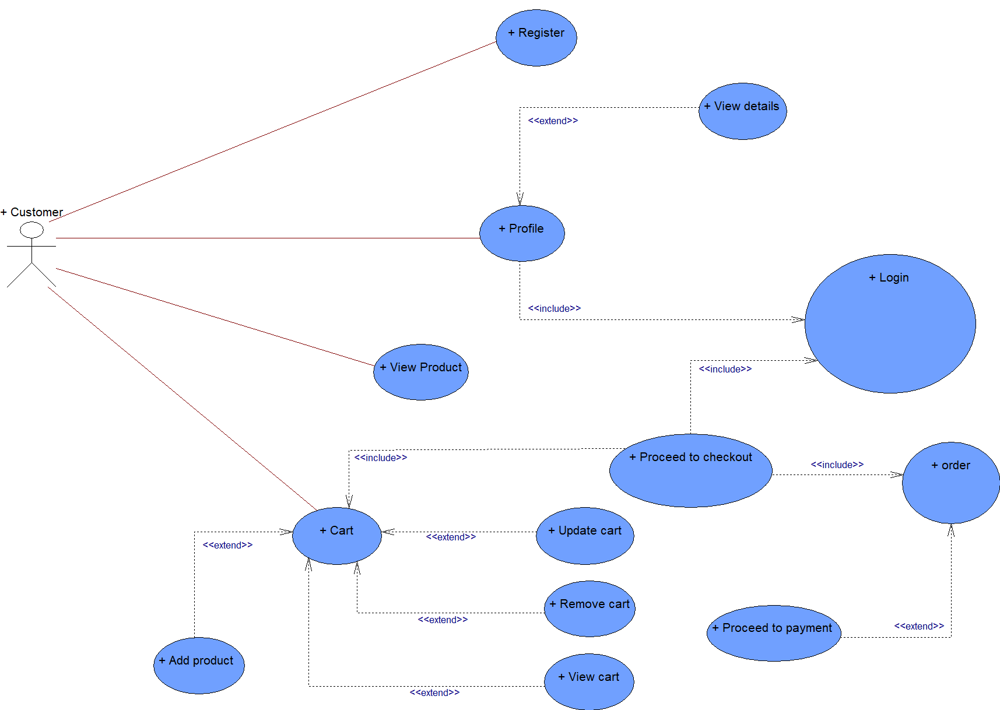
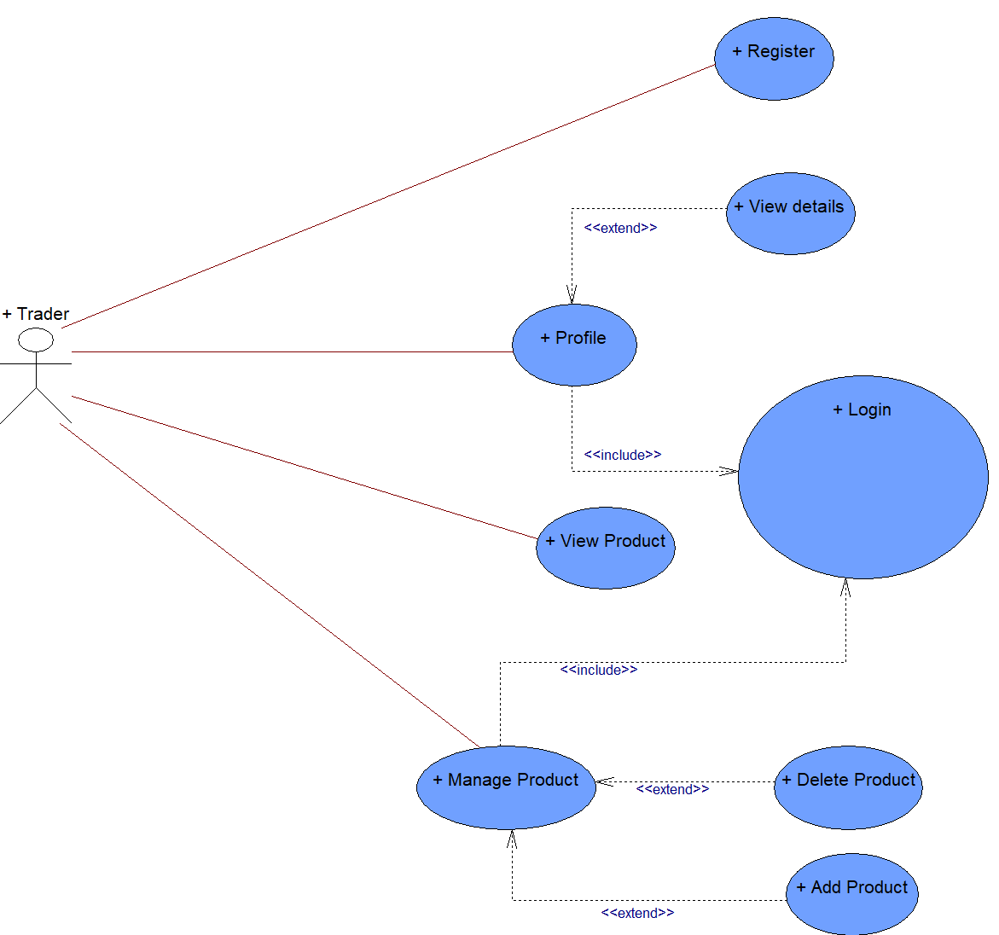

# Buy_Shu E-Commerce Site

**Buy_Shu** is a comprehensive e-commerce platform designed to offer a seamless online shopping experience. The platform provides a wide range of products, including fresh seafood, fruits, baked goods, and more. Our aim is to deliver premium quality products with convenience and security to our customers.


## Features

- **User-Friendly Interface**: Easy navigation and intuitive design for a seamless shopping experience.
- **Product Categories**: Organized categories for efficient browsing and selection.
- **Secure Checkout**: Ensures secure payment transactions.
- **Order Management**: Efficient tracking and management of orders.
- **Responsive Design**: Accessible on various devices including desktops, tablets, and mobile phones.
- **Customer Support**: Reliable support to assist customers with their queries and issues.

## Technologies Used

- **Frontend**: HTML, CSS, JavaScript
- **Backend**: PHP
- **Database**: MySQL (managed with MySQL Workbench)
- **Version Control**: Git
- **Hosting**: A compatible web server. i.e. -> Apache

## Database Schema

The database schema for Buy_Shu is designed to efficiently manage and organize data related to customers, products, orders, and transactions.



- **CUSTOMER**: Stores customer information.
- **PRODUCT**: Contains details of available products.
- **CART**: Manages the products added by customers to their cart.
- **CATEGORY**: Organizes products into categories.
- **TRADER**: Information about traders supplying products.
- **ORDER**: Records customer orders.
- **ORDER_DETAIL**: Detailed information about each order.
- **PAYMENT**: Manages payment transactions.

## Usecase Diagram

The use case diagram outlines all the necessary features for Buy_Shu, making it easier for customers to browse products, place orders, and manage transactions on our site.





## Installation

To run the Buy_Shu project locally, follow these steps:

1. **Clone the repository:**
    ```bash
    git clone https://github.com/AnamolZ/Buy_Shu.git
    ```

2. **Navigate to the project directory:**
    ```bash
    cd Buy_Shu
    ```

3. **Set up the database:**
    - Open MySQL Workbench and create a new database.
    - Import the provided SQL script (`database/schema.sql`) to set up the database schema.

4. **Configure the database connection:**
    - Update the database connection details in the PHP configuration file (`config/database.php`).

5. **Start the server:**
    - Ensure your web server Apache is running.
    - Place the project files in the web server's root directory (`htdocs` for XAMPP).

6. **Visit the site:**
    Open your browser and go to `http://localhost/Buy_Shu`.

## Usage

### Browsing Products
- Navigate through various categories to explore available products.
- Use the search feature to find specific items.

### Adding to Cart
- Select the desired product and quantity.
- Add the product to the cart for checkout.

### Checkout Process
- Review the items in your cart.
- Proceed to secure checkout.
- Enter payment and shipping details.
- Confirm and place your order.

### Order Tracking
- Track your orders from the 'My Orders' section in your account.
- View order history and status.

## Contributing

We welcome contributions to enhance the Buy_Shu platform. To contribute, follow these steps:

1. **Fork the repository:**
    Click the 'Fork' button on the GitHub page.

2. **Clone your forked repository:**
    ```bash
    git clone https://github.com/AnamolZ/Buy_Shu.git
    ```

3. **Create a new branch:**
    ```bash
    git checkout -b feature-name
    ```

4. **Make your changes and commit them:**
    ```bash
    git commit -m 'Description of your changes'
    ```

5. **Push to the branch:**
    ```bash
    git push origin feature-name
    ```

6. **Create a Pull Request:**
    Open a pull request on the original repository with a description of your changes.

## License

This project is licensed under the MIT License. See the [LICENSE](LICENSE) file for more details.

---
